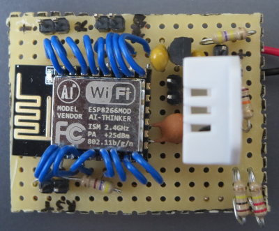
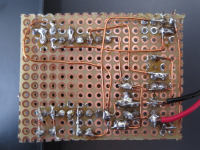

# Arduino ESP12E temperature sensor

This project provides the Arduino software for an ESP12E temperature sensor.

The ESP12E measures the temperature and humidity with a DHT 22 sensor and sends the values via Wifi to an MQTT server.

## Hardware

The hardware design with a step by step instruction can be found on <https://www.vogt.or.at/hardware/temperaturesensor>.

[Fritzing schematics](plans/Temperatursensor.fzz)

Top side:

[Top side large](pictures/ESP_with_ESP_voltage_regulator_topside.jpg)

Bottom side:

[Bottom side large](pictures/ESP_with_ESP_voltage_regulator_underside.jpg)

## 3rd party libraries

The necessary 3rd party libraries are listed in [src/arduino-temperature.cpp](src/arduino-temperature.cpp).

## Configuration

The software must be configured by copying [include/config.h](include/config.h) to [include/config_user.h](include/config_user.h). 

## Working mode

The working mode can be set in the file [include/constants.h](include/constants.h) with the variable `WORK_MODE`.

## Logging

If no connection to the Wifi or MQTT can be made, a log file is written. The log file can be printed in the file [include/constants.h](include/constants.h) with setting the variable `WORK_MODE = WORK_MODE_PRINT_LOGFILES`.
The changed program has to be uploaded to print the log file.
